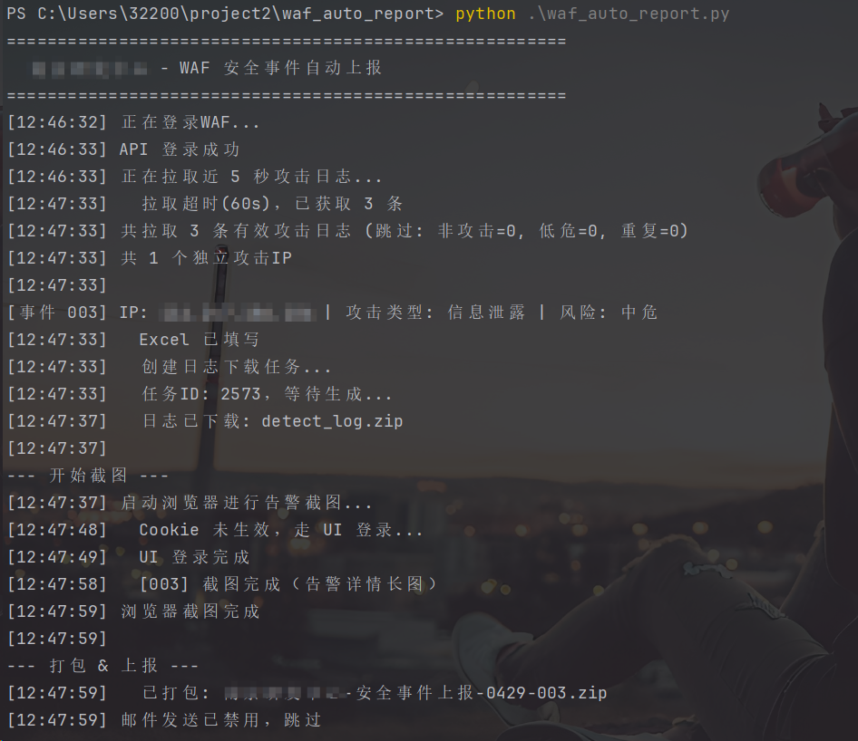
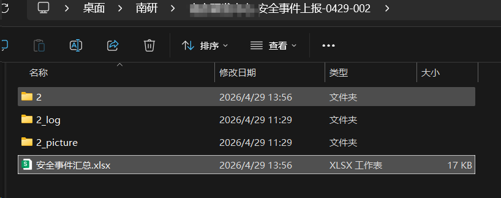
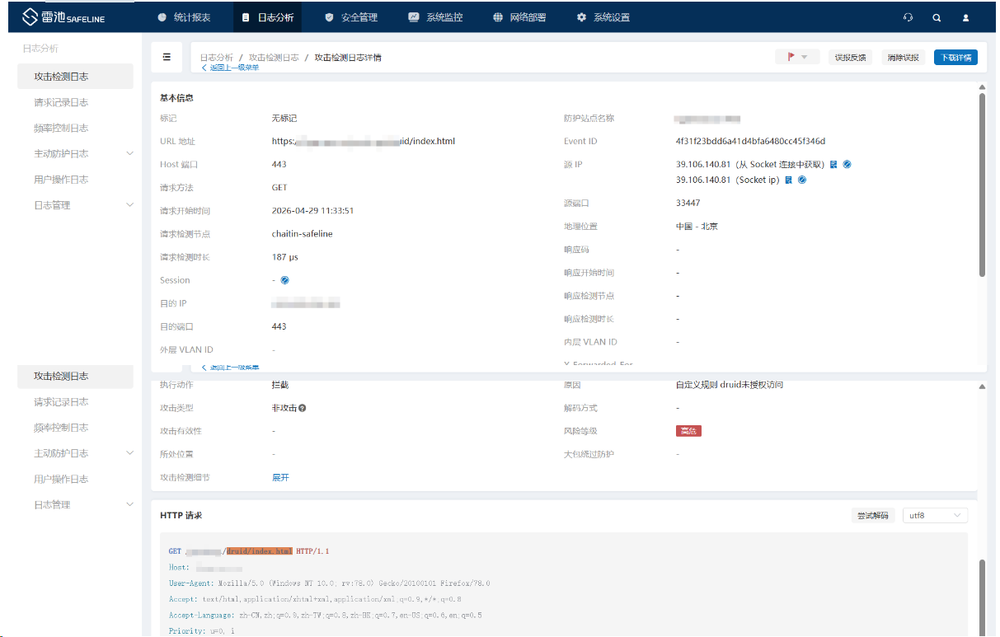

# WAF 安全事件自动化上报工具

某部门长亭WAF（Chaitin SafeLine）攻击事件自动上报工具。自动完成日志拉取、Excel填写、截图、打包全流程。

## 功能

- **自动登录 WAF** — RSA 加密 + CSRF Token 认证
- **智能拉取攻击日志** — 使用 AdvancedFilter API 在服务端过滤，精准获取真实攻击事件
- **按攻击IP自动分组** — 每个独立IP生成一个上报事件
- **自动填写 Excel** — 根据攻击类型映射事件分类
- **长截图** — Playwright 驱动浏览器，滚动拼接截取完整告警详情
- **自动打包** — 生成符合 SOC 上报要求的 zip 包
- **去重机制** — 已上报 IP 自动跳过，不重复上报

## 快速开始

### 1. 安装依赖

```bash
pip install playwright pyyaml pycryptodome openpyxl Pillow requests -i https://pypi.tuna.tsinghua.edu.cn/simple
python -m playwright install chromium
```

### 2. 修改配置

编辑 `config.yaml`，设置防护站点：

```yaml
waf:
  website_name: "your-site-name"  # 目标防护站点，留空则拉取所有站点
```

### 3. 运行

```bash
python main.py
```

## 项目结构

```
waf_auto_report/
├── main.py          # 主流程入口
├── api.py           # API层：登录、拉取日志、下载日志、IP去重
├── config.py        # 配置加载、翻译映射
├── config.yaml      # 配置文件
├── screenshot.py    # Playwright 浏览器长截图
├── excel.py         # Excel 模板填写
├── packaging.py     # 打包 + 邮件发送
└── 安全事件汇总.xlsx  # Excel 模板
```

## 输出示例

整个上报文件需要打包为 "xxx-安全事件上报-0430-001.zip"

```
输出目录/xxx-安全事件上报-0430-001/  （每上报一个事件序号+1）
├── 1/                    # 序号目录
│   └── 安全事件汇总.xlsx
├── 1_log/                # 日志目录
│   └── detect_log.zip
├── 1_picture/            # 截图目录
│   └── 告警详情截图.png    # 完整长截图
├── 安全事件汇总.xlsx       # 副本
└── xxx-安全事件上报-0430-001.zip
```

### 运行结果



最终生成的 zip 文件：



告警详情截图（长截图自动拼接）：



## 邮件上报

工具支持自动发送邮件上报，当前默认关闭。在 `config.yaml` 中配置并启用：

```yaml
email:
  enabled: true                        # 改为 true 启用
  smtp_host: "your_smtp_host"
  smtp_port: 465
  sender: "your_email@example.com"
  sender_password: "your_email_password"
  recipients:
    - "recipient@example.com"
  cc:
    - "cc@example.com"
```

启用后，每次生成事件包会自动发送邮件至指定收件人。

## AI 辅助开发

本项目使用 AI 工具辅助开发与调试：

- **AI 模型**: Claude (Anthropic) — 代码生成、架构设计、Bug 定位与修复
- **开发环境**: Claude Code CLI — 本地代码编辑、多文件重构、Git 管理
- **调试工具**: MCP (Model Context Protocol) + Chrome DevTools — 通过浏览器自动化直接操作 WAF 页面，实时抓取网络请求分析 API 行为，定位问题

### AI 辅助解决的关键问题

| 问题 | 原因 | 解决方案 |
|------|------|----------|
| 拉取到 0 条攻击日志 | `FilterV2API` 不支持服务端过滤，3100万条日志中99.9%是"非攻击"记录，30页内全是非攻击 | 通过 MCP 打开 WAF 页面抓包分析，发现前端使用 `/api/AdvancedFilter` 端点，改用该 API 并传入 `body` 筛选条件 |
| 长截图截不全 | `_find_scroll_container` 返回 DOM 元素序号（157），`_scroll_container_to` 期望匹配元素序号（0），索引不一致导致滚动代码未生效 | 通过 MCP 在浏览器中执行 JS 验证，发现索引不匹配，重构为直接定位第一个匹配容器 |

## 技术栈

- **Python 3.11** — 主语言
- **Playwright** — 浏览器自动化（登录、截图）
- **Pillow** — 截图拼接（滚动长截图）
- **openpyxl** — Excel 读写
- **pycryptodome** — RSA 密码加密
- **requests** — HTTP API 调用
- **PyYAML** — 配置文件解析
